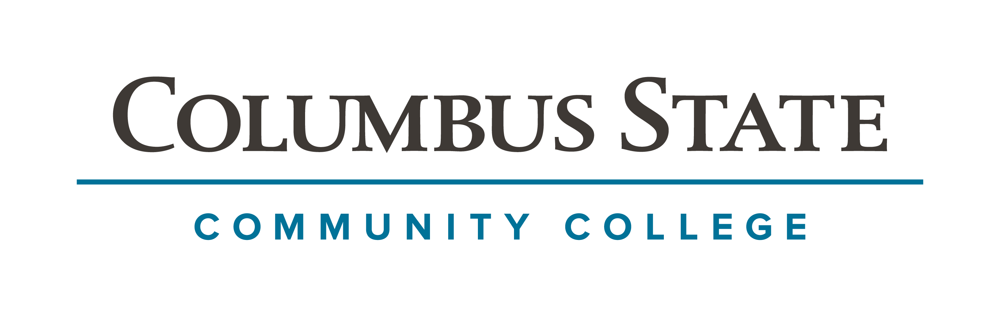

## Welcome to My Learning Portfolio!

<iframe width="560" height="315" src="https://www.youtube.com/embed/PIw9XwFOUYs" title="YouTube video player" frameborder="0" allow="accelerometer; autoplay; clipboard-write; encrypted-media; gyroscope; picture-in-picture; web-share" allowfullscreen></iframe>

<iframe style="border-radius:12px" src="https://open.spotify.com/embed/album/3mppiR8ocWGQIeAprgOFrz?utm_source=generator" width="100%" height="352" frameBorder="0" allowfullscreen="" allow="autoplay; clipboard-write; encrypted-media; fullscreen; picture-in-picture" loading="lazy"></iframe>

This is my GitHub Learning Portfolio where I will present topics about furthering education.

I graduated from The Ohio State University in 2019 and worked in industry as a supplier for Honda for 3 years. After getting hands on experience, I've now transitioned to working in education at CSCC, furthering my skills as a IT Analyst and Project Manager.

My goal is to continue my education as a lifelong learner and encourage others to do so as well. I also enjoy reading and longboarding whenever I get the chance.

Below are some of my accomplishments being both a educator and student participating in our non-credit IT programs.
