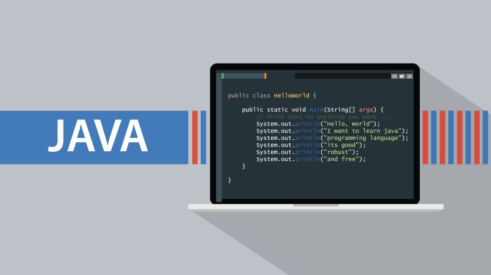

<iframe width="560" height="315" src="https://www.youtube.com/embed/PIw9XwFOUYs" title="YouTube video player" frameborder="0" allow="accelerometer; autoplay; clipboard-write; encrypted-media; gyroscope; picture-in-picture; web-share" allowfullscreen></iframe>

## Java II

After being hired onto the Columbus State Workforce Innovation team, I reviewed our Software Development courses. I was getting used to Blackboard and familiarizing myself with our course content. At the time, our program had a Java II class starting in a few weeks, but our regular instructors were either unavailable or teaching another class. When we need instructors, we regularly hire from outside CSCC. But now there was an opportunity to teach a course myself.

It was my first time teaching professionally, so I was excited and nervous. But once I got into the swing of things, I found it to be a very comfortable experience that was both rewarding and challenging. Teaching also gave me hands-on experience with how our instructors work in our environment, understanding the pitfalls students may face when learning course content.

Overall, it was a great experience, accelerating my understanding of the process of the non-credit side of the college.

## Intro to Java

This year I was given another oppertunity to teach. Our Introduction to Java Programming course had not been updated in sometime. I had already reviewed our other Software Development courses, so instructing this class would allow me to get more practice teaching and clean up the course itself. I now had experience with Java 2, so I could compare what content needed updates.

This experience taught me how to update a course to a Comptenecy Based Education (CBE) format. It also strengthened my skills in test writing and creating examples.

